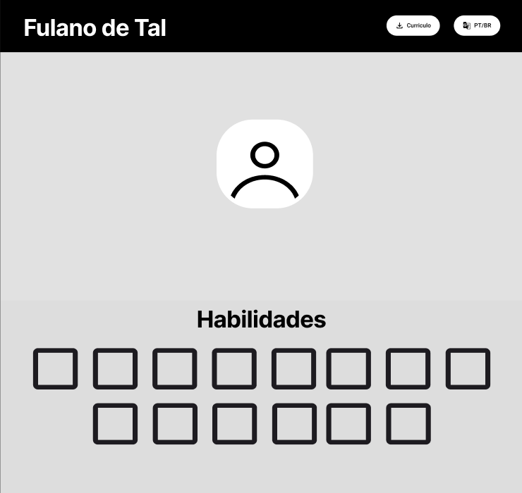
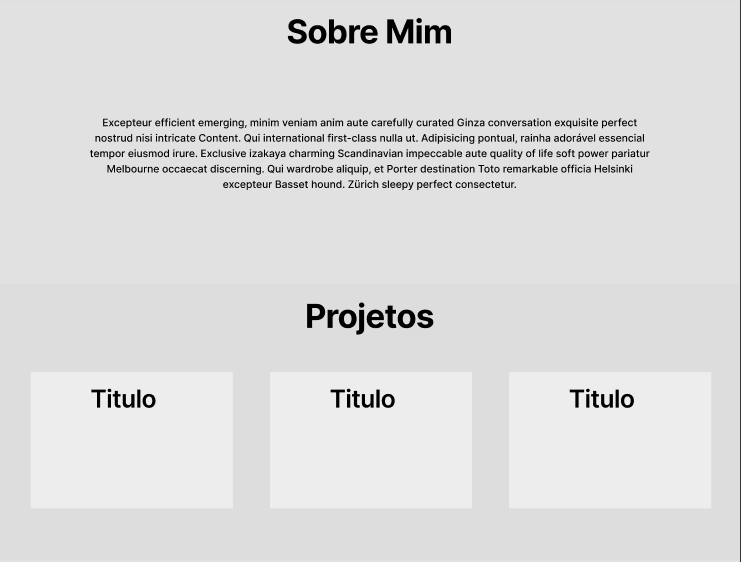
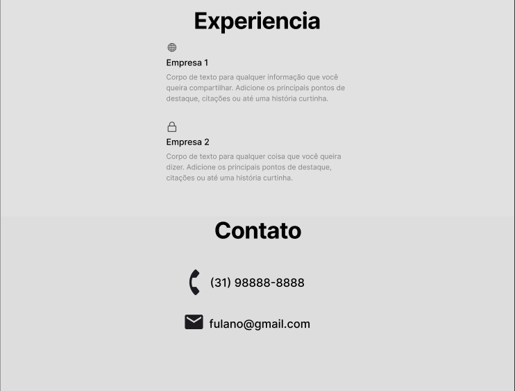

# 💼 Portfólio Pessoal - Projeto de Site

## 📌 Descrição do Projeto

Este projeto tem como objetivo desenvolver um site de portfólio pessoal para exibir habilidades técnicas, experiências profissionais, projetos realizados e formas de contato. A estrutura do site é simples, direta e responsiva, facilitando a navegação tanto em desktops quanto em dispositivos móveis.

O site foi desenvolvido com HTML, CSS e JavaScript puros, e está dividido em seções intuitivas como: **Sobre Mim**, **Habilidades**, **Projetos**, **Experiência Profissional** e **Contato**.

---

## 🧱 Estrutura Inicial do Site

- **Cabeçalho fixo:** nome, botão de currículo e botão de troca de idioma.
- **Imagem de perfil:** espaço reservado para a foto do desenvolvedor.
- **Habilidades:** exibição em grid das principais stacks.
- **Sobre Mim:** parágrafo de introdução e contexto profissional.
- **Projetos:** cards com os principais trabalhos, com título e descrição.
- **Experiência:** descrição das empresas onde trabalhou e principais responsabilidades.
- **Contato:** telefone e e-mail para contato profissional.

---

## 🛠️ Tecnologias Utilizadas

- **HTML5** – Estrutura e semântica da página  
- **CSS3** – Estilização e responsividade  
- **JavaScript** – Funcionalidades de interação, transições e animações básicas  
- **Font Awesome** – Ícones utilizados nas seções e botões  
- **Google Fonts (Montserrat)** – Tipografia padronizada

---

## 🖼️ Protótipos Iniciais

### Tela Inicial, Habilidades



### Sobre Mim e Projetos



### Experiência e Contato



🔗 [Acessar protótipo no Figma](https://www.figma.com/design/vqXQkjnAAOXrcRvKzXbBmc/Sem-t%C3%ADtulo?node-id=0-1&t=hmTPWhLoyBoFXJkz-1)

---

## 📁 Estrutura de Arquivos

```bash
📁 Lab01 - Portfólio Profissional/
├── index.html
├── styles.css
├── scripts.js
├── img/
│   ├── Profile.jpg
│   ├── icons.svg
│   └── ...
└── pdf/
    └── Certificado.pdf
```
