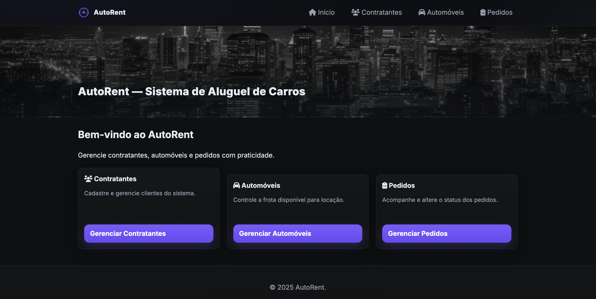
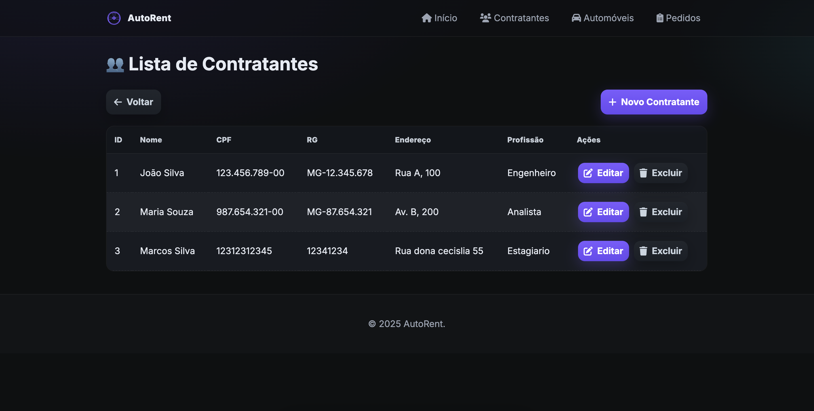
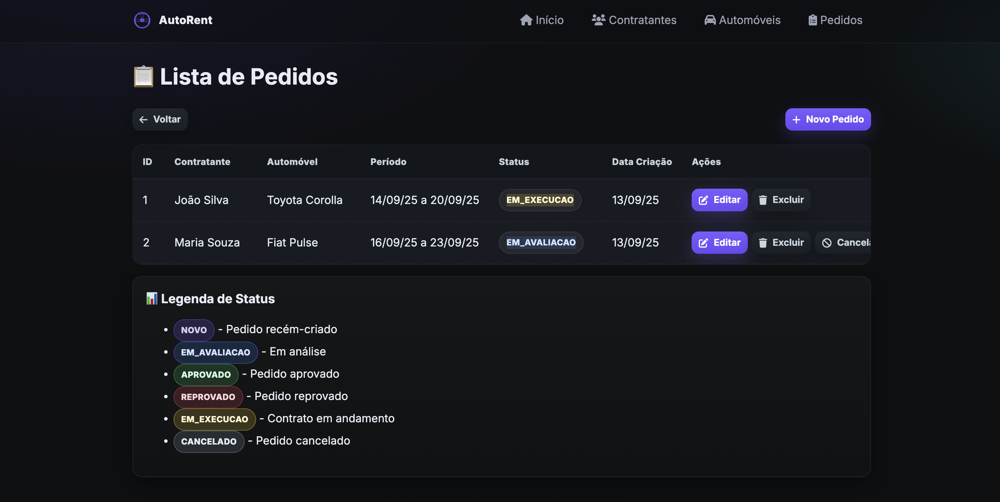

# 🚗 AutoRent - Sistema de Aluguel de Carros


AutoRent é um sistema acadêmico desenvolvido como **projeto de laboratório** para a disciplina de Engenharia de Software.  
O objetivo é simular um sistema moderno de gerenciamento de uma locadora de automóveis, com foco em **boas práticas de desenvolvimento**, **UI/UX moderna** e **funcionalidades completas**.

---

## ✨ Funcionalidades

- Cadastro e gerenciamento de **Automóveis**
- Cadastro e gerenciamento de **Contratantes**
- Criação e acompanhamento de **Pedidos**
- Aprovação/Reprovação de pedidos diretamente nos **detalhes**
- Banco de dados em **H2** com possibilidade de **seeding inicial**
- Interface **dark mode** responsiva e moderna
- Notificações de sucesso/erro com **animações**
- Componentes customizados (**switch de ativo**, botões estilizados, badges de status, etc.)

---

## 🖼️ Screenshots

### Tela Inicial


### Lista de Automóveis


### Cadastro de Automóvel


### Lista de Contratantes


### Cadastro de Contratante


### Lista de Pedidos


### Detalhes de Pedido + Aprovação


---

## 🛠️ Tecnologias

- **Java 17** + **Spring Boot 3**
- **Thymeleaf** para templates dinâmicos
- **Spring Data JPA** + **H2 Database**
- **Maven** como gerenciador de dependências
- **HTML5 + CSS3 (customizado)**  
- **JavaScript** para interatividade
- **Notificações animadas** e **UI responsiva**

---

## ⚙️ Como rodar o projeto

1. Clone o repositório:
   ```bash
   git clone https://github.com/DMendes7/Lab-Projeto-de-Software.git
   cd Projetos/Lab02 - Sistema de Aluguel de Carros
   cd car-rental-system
   ```

2. Compile e rode com Maven:
   ```bash
   mvn spring-boot:run
   ```

3. Acesse no navegador:
   ```
   http://localhost:8080
   ```

---

## 📂 Estrutura do Projeto

```
car-rental-system/
├── src/
│   ├── main/
│   │   ├── java/com/carrental/...    # Código fonte
│   │   ├── resources/
│   │   │   ├── static/css            # Estilos (style.css)
│   │   │   ├── static/js             # Scripts (notifications.js)
│   │   │   └── templates             # Páginas HTML (Thymeleaf)
│   └── test/                         # Testes automatizados
├── img/                              # Imagens para o README
└── README.md
```

---

## 👨‍💻 Autor

Projeto acadêmico desenvolvido por **Davi Mendes**  
PUC Minas - Engenharia de Software

[](https://www.linkedin.com/in/dmendes7)
[](https://github.com/DMendes7)

---

## 📜 Licença

Este projeto é apenas para fins acadêmicos.  
Uso livre para aprendizado, mas não para produção comercial.
