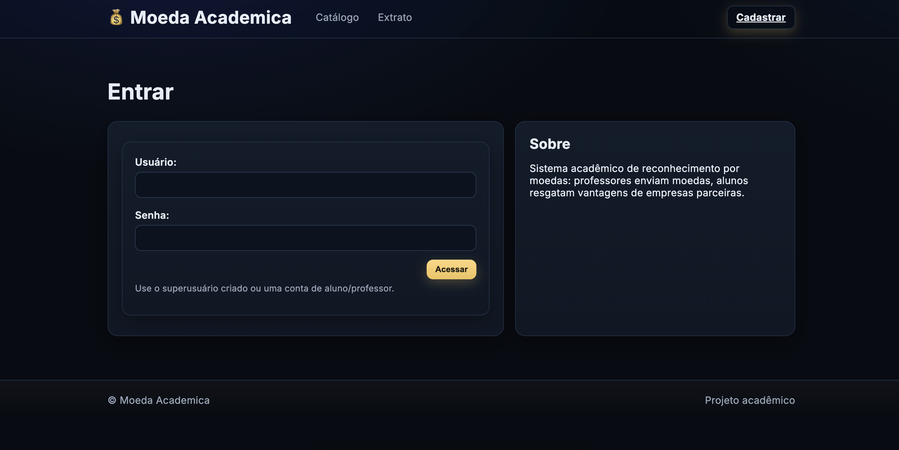
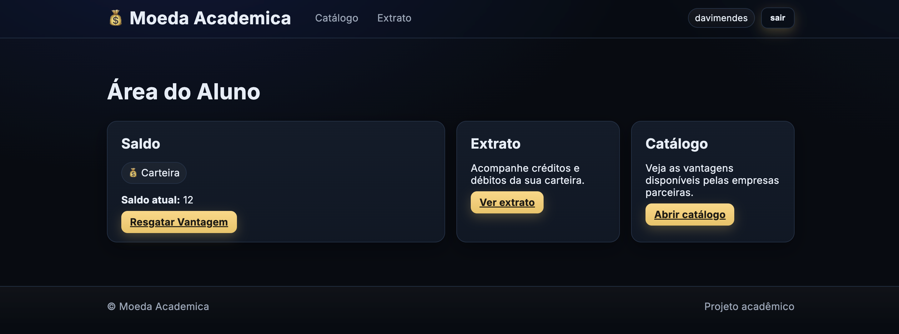
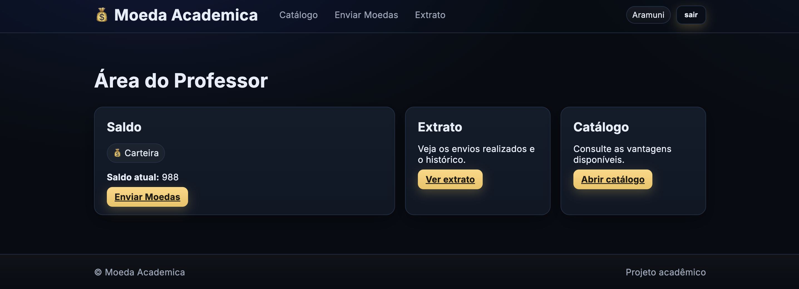
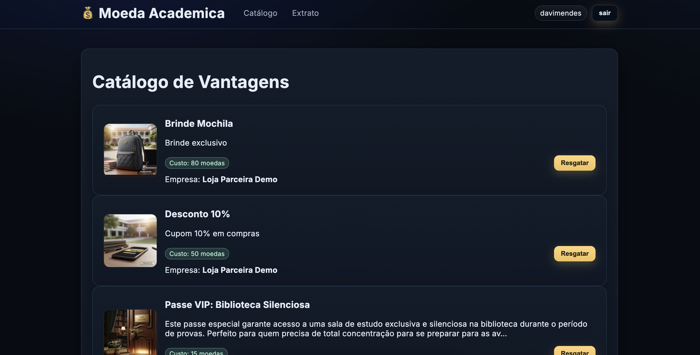
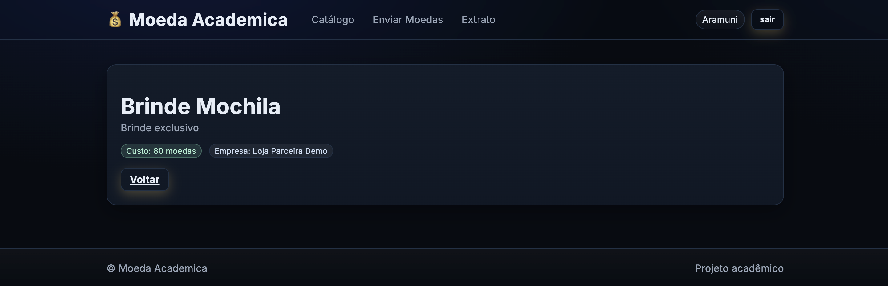
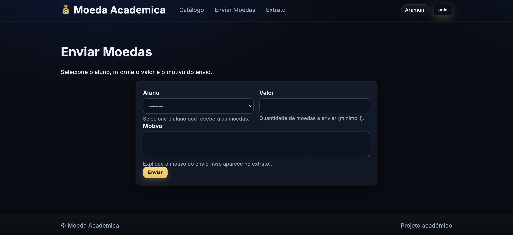
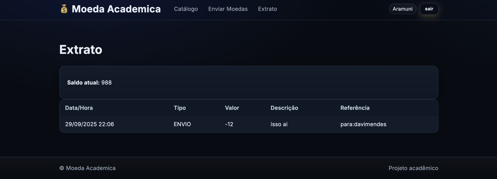
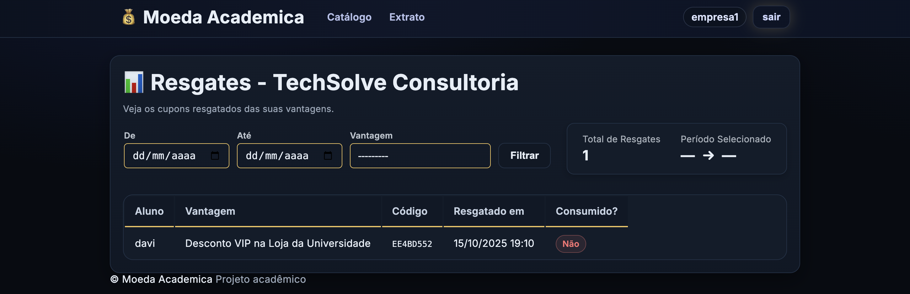

# 🎓💰 Sistema de Moeda Estudantil (Lab03)

<p align="center">
  
</p>

Bem-vindo ao **Sistema de Moeda Estudantil**!  
Este projeto foi desenvolvido no contexto da disciplina **Laboratório de Projeto de Software (Lab03)** e simula um ecossistema acadêmico em que **professores, alunos e empresas parceiras** interagem por meio de uma moeda virtual utilizada para incentivar e premiar estudantes.

---
## 🌐 Online - Render
- https://lab-projeto-de-software.onrender.com/
---

## 🚀 Funcionalidades Principais

- 👩‍🏫 **Professores**  
  - Podem enviar moedas aos alunos.  
  - Definem um motivo para cada envio.  

- 🧑‍🎓 **Alunos**  
  - Recebem moedas e podem consultar seu **extrato**.  
  - Podem **resgatar vantagens** no catálogo, como descontos e brindes.  
  - Ao resgatar, recebem um **cupom por e-mail** com código único para troca presencial.  

- 🏢 **Empresas Parceiras**  
  - Possuem login próprio.  
  - Podem acompanhar apenas os **resgates vinculados às suas vantagens**.  

- ✉️ **Notificações por e-mail**  
  - E-mail de moedas recebidas (ao aluno).  
  - E-mail de cupom de resgate (com código exclusivo).  

---

## 📂 Estrutura do Projeto

```bash
LABORATÓRIO 03 - Sistema de Moeda Estudantil
├── README.md                  # 📘 Este arquivo
├── manage.py                  # 🚦 Script de gerenciamento Django
├── requirements.txt           # 📦 Dependências do projeto
├── db.sqlite3                 # 🗄️ Banco de dados SQLite (dev)
│
├── moeda_estudantil/          # ⚙️ Configurações principais do projeto
│   ├── settings.py
│   ├── urls.py
│   └── wsgi.py
│
├── apps/                      # 📦 Aplicações Django
│   ├── accounts/              # 👥 Usuários (alunos, professores, parceiros)
│   ├── catalog/               # 🎁 Catálogo de vantagens
│   ├── core/                  # 🛠️ Utilitários e middlewares
│   ├── institutions/          # 🏫 Instituições acadêmicas
│   ├── notifications/         # ✉️ Serviços de e-mail
│   ├── partners/              # 🏢 Empresas parceiras
│   ├── transactions/          # 💸 Envio de moedas (transações)
│   └── wallet/                # 👛 Carteira do aluno (saldo, resgates)
│
├── templates/                 # 🎨 Templates HTML
│   ├── accounts/              # Dashboards e login
│   ├── catalog/               # Telas do catálogo
│   ├── emails/                # Modelos de e-mails (HTML e TXT)
│   ├── partners/              # Telas para empresas
│   ├── transactions/          # Envio de moedas / extrato
│   └── wallet/                # Resgatar vantagem
│
├── static/                    # 🖼️ Arquivos estáticos
│   ├── css/
│   └── js/
│
├── media/                     # 📸 Arquivos enviados (ex: imagens das vantagens)
│   └── vantagens/
│       ├── 10-desconto.png
│       ├── mochila.png
│       └── silent-library.png
│
├── docs/                      # 📑 Documentação do projeto
│   ├── Diagrama de Casos de Uso.png
│   ├── Diagrama de Classes.png
│   ├── Diagrama de Componentes.png
│   └── historias-de-usuario.md
│
└── scripts/                   # 🔧 Scripts auxiliares
    ├── dev_bootstrap.sh
    ├── run_local.sh
    └── seed_demo.py
```

---

## 🖼️ Telas do Sistema

### 🔐 Login
> Caminho: `templates/accounts/login.html`  


---

### 🧑‍🎓 Dashboard do Aluno
> Caminho: `templates/accounts/dashboard_aluno.html`  


---

### 👩‍🏫 Dashboard do Professor
> Caminho: `templates/accounts/dashboard_professor.html`  


---

### 🎁 Catálogo de Vantagens
> Caminho: `templates/catalog/vantagens_list.html`  


---

### 📄 Detalhe da Vantagem
> Caminho: `templates/catalog/vantagem_detail.html`  


---

### 💸 Envio de Moedas
> Caminho: `templates/transactions/envio_moedas.html`  


---

### 📜 Extrato
> Caminho: `templates/transactions/extrato.html`  


---

### 🏢 Dashboard da Empresa Parceira
> Caminho: `templates/partners/resgates_list.html`  


---

## 📬 Notificações por E-mail

- **Moedas Recebidas** → `templates/emails/moedas_recebidas.html`  
- **Cupom Resgatado** → `templates/emails/cupom_resgatado.html`  

  
  

---

## 🛠️ Tecnologias Utilizadas

- **Backend**: Django 5.x + Python 3.13  
- **Banco de Dados**: SQLite (desenvolvimento)  
- **Frontend**: HTML5, CSS3, JS (básico)  
- **Templates**: Django Templates  
- **Notificações**: SMTP (Gmail)  
- **Gerenciamento**: `pip`, `venv`, scripts de seed/demo  

---

## 👨‍💻 Autores

Projeto desenvolvido por **Davi Mendes** no contexto do curso de Engenharia de Software (PUC Minas).
