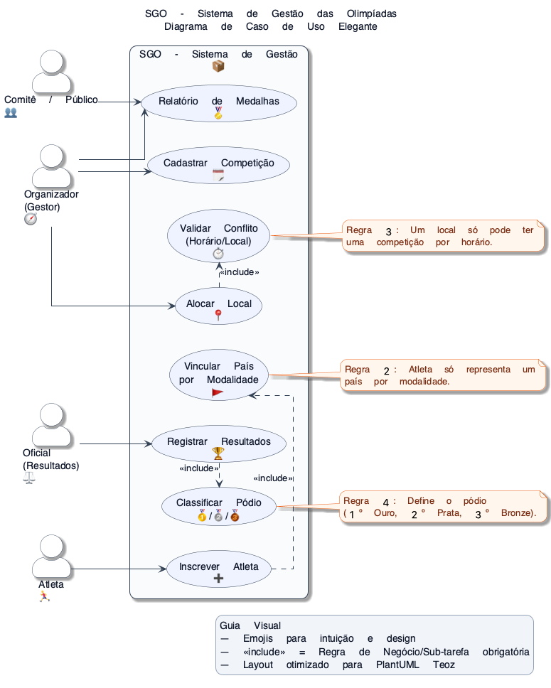
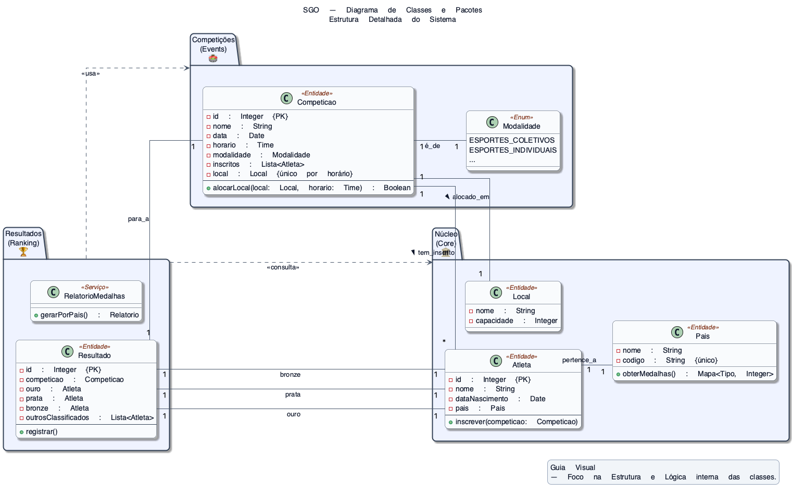
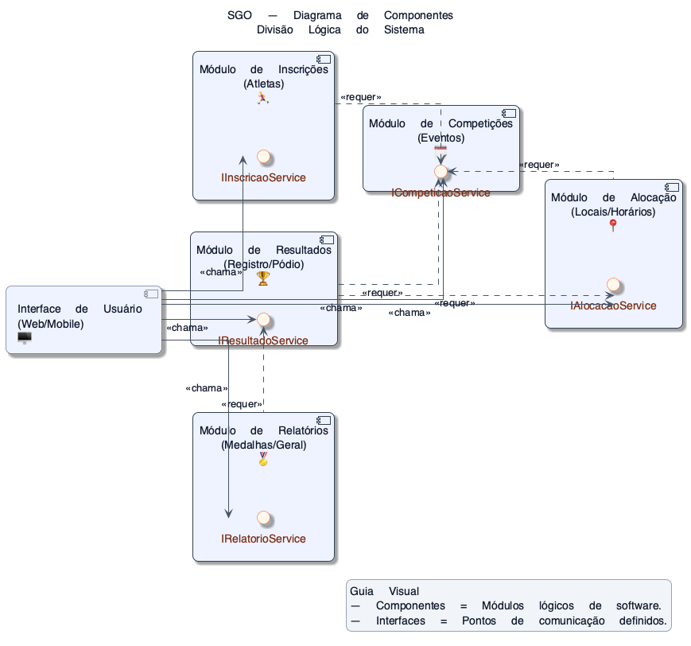
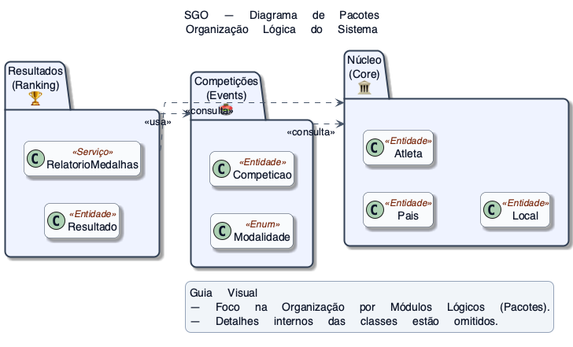
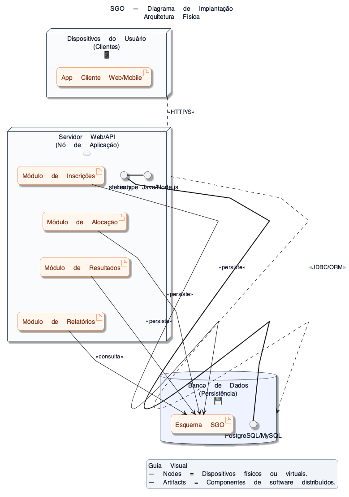

# 🏆 SGO — Sistema de Gestão das Olimpíadas

  
  
  

## 1. 📚 Informações Gerais

[cite_start]Este trabalho é a primeira entrega da disciplina **Projeto de Software** [cite: 3] [cite_start]e contém a modelagem UML (Unified Modeling Language) completa para o **Sistema de Gestão das Olimpíadas (SGO)**[cite: 5]. [cite_start]O projeto não requer o desenvolvimento do código, apenas a modelagem/diagramação[cite: 33].

* [cite_start]**Disciplina:** Projeto de Software [cite: 4]
* [cite_start]**Professor:** João Paulo Carneiro Aramuni [cite: 4]
* [cite_start]**Sistema:** Sistema de Gestão das Olimpíadas (SGO) [cite: 5]

## 2. 📝 Regras de Negócio Chave

[cite_start]O sistema deve permitir o gerenciamento de competições, inscrições de atletas, alocação de locais para as provas e controle de resultados[cite: 7].

* [cite_start]**Cadastro:** Competições devem incluir nome da modalidade, data, horário, local e lista de atletas inscritos[cite: 10].
* [cite_start]**Inscrição:** Cada atleta pode participar de várias competições, mas só pode representar um país em cada modalidade[cite: 13].
* [cite_start]**Alocação:** Um local só pode abrigar uma competição por vez, e a alocação deve evitar conflitos de horário[cite: 16, 15].
* [cite_start]**Resultados:** Após as competições, os resultados devem ser registrados, determinando o vencedor e os classificados em segundo e terceiro lugares[cite: 18].
* [cite_start]**Relatórios:** O sistema deve gerar relatórios de medalhas, mostrando o desempenho de cada país com base nas medalhas de ouro, prata e bronze conquistadas[cite: 20].

## 3. 🏃 Histórias de Usuário (User Stories)

[cite_start]As Histórias de Usuário (US) documentam as funcionalidades do sistema por escrito:

| ID | Caso de Uso | História de Usuário (Como **[Ator]**, Eu quero **[Meta]**, Para que **[Valor]**) |
| :--- | :--- | :--- |
| **US01** | **Cadastrar Competição** | [cite_start]Como **Organizador**, eu quero cadastrar uma nova competição, para que o evento seja agendado e possa receber inscrições[cite: 10]. |
| **US02** | **Inscrever Atleta** | [cite_start]Como **Atleta**, eu quero me inscrever em uma competição, representando meu país na modalidade, para que eu possa participar do evento[cite: 13]. |
| **US03** | **Alocar Local** | [cite_start]Como **Organizador**, eu quero alocar um local para uma competição, validando a ausência de conflitos de horário, para garantir a logística correta[cite: 15, 16]. |
| **US04** | **Registrar Resultados** | [cite_start]Como **Oficial**, eu quero registrar os resultados da competição, para que os atletas em 1º, 2º e 3º lugares sejam determinados[cite: 18]. |
| **US05** | **Relatório de Medalhas** | [cite_start]Como **Comitê**, eu quero gerar um relatório de medalhas por país, para que o desempenho das nações seja visualizado[cite: 20]. |

## 4. 📐 Diagramas UML (Modelagem)

[cite_start]Todos os diagramas foram desenvolvidos com foco na clareza, correção e elegância visual[cite: 31].

### 4.1. Diagrama de Caso de Uso (UC) 🧭

[cite_start]Modelagem dos Casos de Uso principais e das interações dos atores[cite: 25, 26].

    

### 4.2. Diagrama de Classes e Pacotes 🏛️

[cite_start]Estrutura do sistema (Classes: Competição, Atleta, Local, Resultado e País) [cite: 27] [cite_start]e sua organização lógica em Pacotes[cite: 28].

    

### 4.3. Diagrama de Componentes ⚙️

[cite_start]Representação dos módulos principais (Interface de Usuário, Módulo de Inscrições, etc.) e como eles interagem[cite: 29].

    

### 4.4. Diagrama de Pacotes 📦

[cite_start]Visão de alto nível da organização modular do sistema[cite: 28].

    

### 4.5. Diagrama de Implantação ☁️

[cite_start]Ilustração da arquitetura física (servidores, DB, dispositivos dos usuários) e como os componentes são distribuídos[cite: 30].

    

## 5. 🗂️ Estrutura do Repositório

[cite_start]O repositório está organizado conforme as instruções de entrega:

| Diretório / Arquivo | Conteúdo | Requisito de Entrega |
| :--- | :--- | :--- |
| **`README.md`** | Documentação completa e Histórias de Usuário. | [cite_start]Obrigatório  |
| **`img/`** | 5 Diagramas UML em formato PNG. | [cite_start]Obrigatório (Exibir imagens)  |
| **`diagramas/`** | Arquivos-fonte (`.puml`) e de projeto (`.drawio` ou `.astah`). | [cite_start]Obrigatório (Arquivos de projeto) [cite: 53, 54, 55, 56, 57] |

### Próxima Ação:

[cite_start]O seu último passo é **commitar** este `README.md` e todos os arquivos para o GitHub, garantir que o repositório esteja público e entregar a **URL** no **CANVAS**[cite: 32].