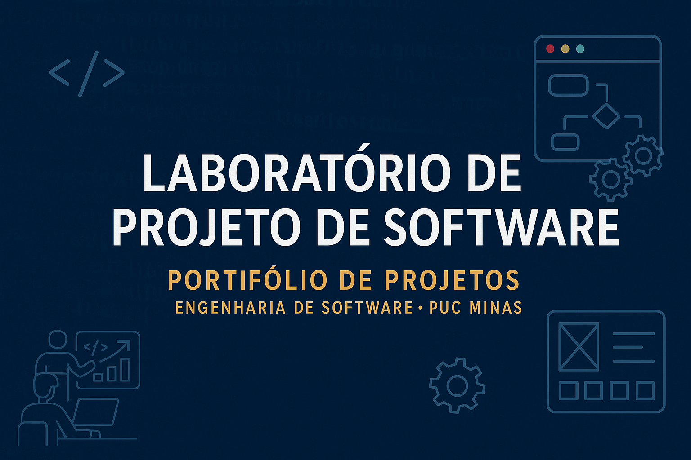

# 🧪 Laboratório de Projeto de Software — Portfólio de Projetos

Este repositório reúne **todas as entregas práticas** realizadas durante a disciplina **Laboratório de Projeto de Software**, no 4º período do curso de Engenharia de Software na PUC Minas.  

Cada projeto foi desenvolvido em equipe, seguindo o modelo incremental de entregas (Sprints) e aplicando boas práticas de versionamento, arquitetura e documentação.  

---

## 📂 Conteúdo do Repositório

# Projetos

Os projetos da disciplina foram reorganizados e agora ficam dentro da pasta `Projetos/`.  
Cada projeto possui seu README próprio com instruções de execução e screenshots.

- **Projeto 1 — Portfólio Profissional**  
  Desenvolvimento de um website pessoal para apresentação de trajetória, habilidades, projetos e formas de contato, com design responsivo e hospedagem em nuvem.

- **Projeto 2 — Sistema de Aluguel de Carros**  
  Sistema web para gestão de pedidos e contratos de aluguel de automóveis, com funcionalidades de cadastro, consulta e modificação de pedidos, integrado a um modelo de dados completo.

- **Projeto 3 — Sistema de Moeda Estudantil (Release 1)**  
  Primeira versão de um sistema para reconhecimento de mérito estudantil por meio de uma moeda virtual distribuída por professores e trocada por vantagens.

- **Projeto 4 — Sistema de Moeda Estudantil (Release 2)**  
  Continuação do sistema, com implementação dos casos de uso de envio de moedas, consulta de extratos, cadastro e listagem de vantagens:contentReference.

- **Projeto 5 — Sistema de Moeda Estudantil (Release 3)**  
  Versão final do sistema, com envio de cupons por e-mail, análise crítica de projetos da turma, refatorações e melhorias na arquitetura e usabilidade.

## 📑 Resenhas de Artigos

Conjunto de resenhas críticas dos artigos estudados ao longo da disciplina de Projeto de Software.  
Cada resenha está organizada em sua respectiva pasta dentro de `Artigos/`.

- **Artigo 1 — The Big Ball of Mud**  
  Resenha sobre o artigo de Brian Foote e Joseph Yoder, discutindo sistemas mal estruturados (“Big Ball of Mud”), suas causas, consequências e relevância prática.

---

## 🛠️ Tecnologias Utilizadas

Ao longo dos projetos, foram aplicadas diversas tecnologias e ferramentas, como:
- **Linguagens:** Java, JavaScript, HTML, CSS
- **Frameworks:** Spring Boot, Spring MVC, React
- **Banco de Dados:** PostgreSQL, MySQL
- **Modelagem:** UML, Diagramas de Caso de Uso, Classes, Componentes, Sequência e Implantação
- **Controle de Versão:** Git/GitHub
- **Hospedagem:** Vercel, Render

---

## 📑 Organização

Cada pasta de projeto contém:
- Código-fonte
- Diagramas e artefatos de modelagem
- README próprio com descrição, requisitos, arquitetura, tecnologias e instruções de execução
- Evidências (prints, gifs, ou vídeos)

---

## 📌 Observação
Este repositório serve como registro do aprendizado prático adquirido durante a disciplina, evidenciando desde a prototipação até a entrega final de sistemas completos, passando por modelagem, implementação, testes, refatoração e apresentação.

---

